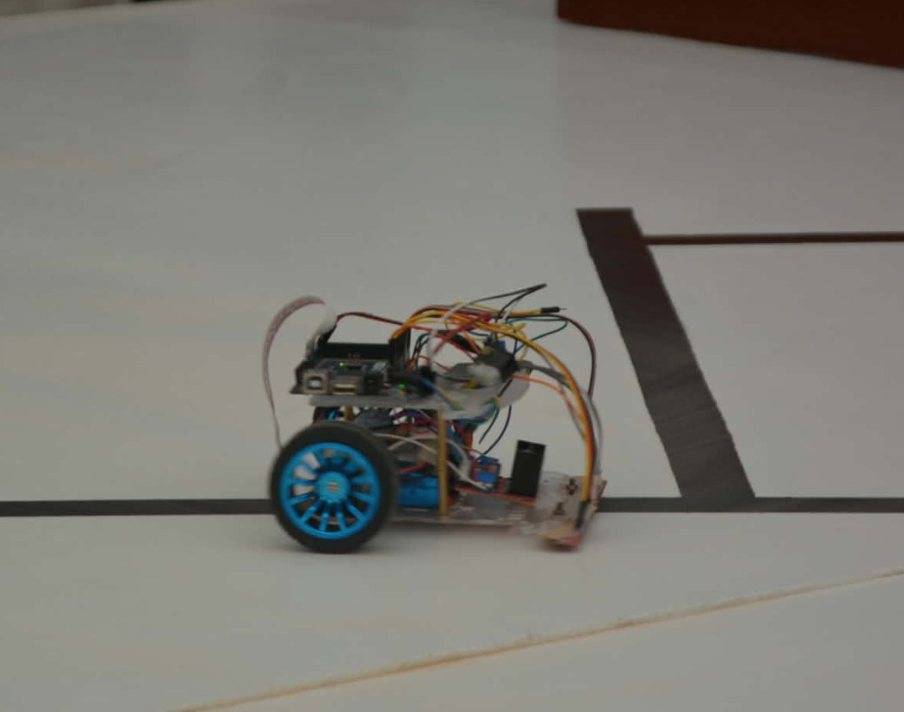
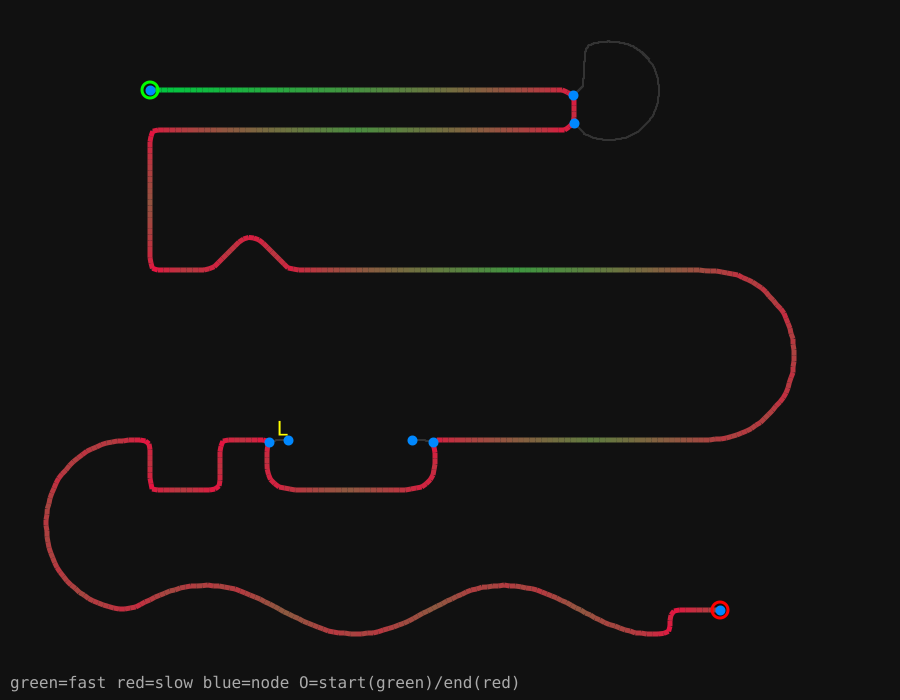
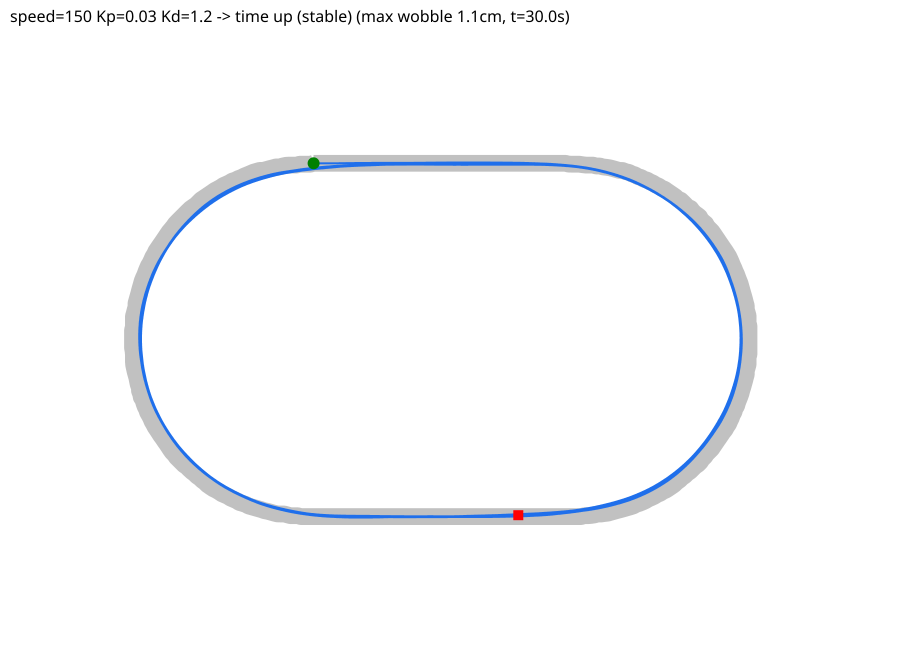

# Line-Following Robot + PID Simulator
> 16-sensor PID follower, plus a Python simulator that tunes the gains from a photograph of the track.
`2026` · `Arduino` · `PID control` · `Python` · `OpenCV` · `Simulation` · `L298`



## About

A competition line follower: 16 QTR reflectance sensors across the front, two motors through an L298-class driver, and a PID loop running every ~2 ms. The sensor bar reports one number — where the line sits relative to centre — and the controller turns that into a differential wheel speed.

**Firmware.** Beyond the PID itself, two behaviours make the same upload survive any track: *corner braking*, where base speed is reduced in proportion to steering effort so the robot slows into turns instead of overshooting, and *line recovery*, where losing the line triggers a pivot toward the side the line was last seen. I found and fixed six firmware bugs during bring-up.

**The simulator is the interesting part.** Rather than tuning on the real robot, I wrote a Python simulator with `autotune`, `sweep` and `animate` modes. It settled on KP 0.030, KD 1.2, base speed 200, and produced two findings that changed how the robot is tuned: going faster means raising base speed while holding corner braking near 1.0 — raising corner braking only makes corners slower, it is a smoothness knob, not a speed one. And KD is loop-time dependent, because the derivative term is computed per iteration; the sketch prints its own average loop time so the gain can be rescaled.

**From photo to plan.** A companion tool takes a top-down image of a real track, thresholds it, skeletonises it to a one-pixel centreline, builds a graph of straights and junctions, routes through it, and emits a speed profile — fast on straights, slow in tight curves — plus the path tokens for the maze firmware and an annotated SVG. The same vision front-end can load your real track straight into the simulator, so the gains are tuned for that track before the robot ever touches it.

## Figures





## Contents

```
GUIDE.md
SESSION_NOTES.md
SimpleLineFollower/
_proof_tests/
a_pins_vars/
docs/
simulator/
```

## Notes

Not included in this repository: 4 generated/binary file(s) - build caches, generated toolpaths and oversized binaries are kept out on purpose. The source they are generated from is here.

## Third-party work used here

Everything in this repository is my own work. It builds on the following, which are **not** mine and are used under their own licences:

- **FastLED** by FastLED project — <https://github.com/FastLED/FastLED>
- **LiquidCrystal** by Arduino — <https://github.com/arduino-libraries/LiquidCrystal>
- **MPU6050_light** by rfetick — <https://github.com/rfetick/MPU6050_light>
- **QTRSensors** by Pololu — <https://github.com/pololu/qtr-sensors-arduino>
- **Ultrasonic** by Erick Simoes — <https://github.com/ErickSimoes/Ultrasonic>
- **Arduino core** by Arduino — <https://github.com/arduino/ArduinoCore-avr>

## Author

Lassaad Mahmoudi — <assaadmahmoudi0@gmail.com>  
https://linkedin.com/in/mahmoudiassaad
